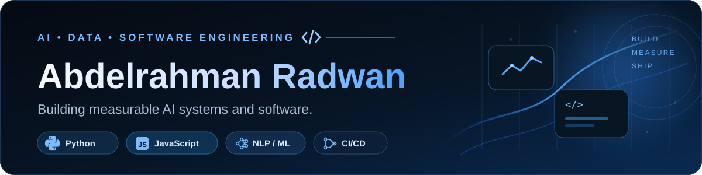

  

  
  

## About me

I’m a **Business Analytics & Artificial Intelligence student** focused on building explainable AI, data products, and software that can be measured, inspected, and improved.

I’m especially interested in **machine learning systems, NLP, data products, software engineering, responsible AI, and technical product development**.

> **I care more about what a system can prove than what it can claim.**

## Featured project - JobFit

**Evidence-first resume-to-job matching**

JobFit maps job requirements to supporting evidence already present in a resume using **MiniLM sentence embeddings, cosine similarity, and hybrid semantic + lexical retrieval**.

- **ML / NLP:** MiniLM embeddings, semantic retrieval, cosine similarity, hybrid ranking
- **Evaluation:** dev/test split, hard negatives, precision/recall/F1/accuracy, latency, error analysis
- **Engineering:** PDF/DOCX/TXT parsing, browser inference, lexical fallback, CI/CD, unit tests, protected pull requests
- **Product:** explainable evidence mapping, resume health, keyword coverage, prioritized action queue
- **Measured result:** **0.917 F1**, **1.000 precision**, **0.900 accuracy** on the current held-out regression benchmark

  
  
  
  

## Featured project - LectureLens

**Local-first AI lecture search and study companion**

LectureLens records or imports lecture audio, transcribes it locally with **Whisper**, turns the transcript into timestamp-aware chunks, and retrieves the strongest source passage for a student's question.

- **Speech / ML:** Whisper Tiny English, MiniLM embeddings, cosine similarity, hybrid semantic + lexical retrieval
- **Audio engineering:** MediaRecorder, Web Audio API, waveform feedback, timestamp-linked playback
- **Evaluation:** grouped hard negatives, dev/test separation, Recall@1/Recall@3/MRR, LibriSpeech WER, and real classroom CoTACS WER
- **Engineering:** IndexedDB multi-lecture persistence, Web Worker ML inference, Playwright browser tests, CI/CD, GitHub Pages, protected main
- **Measured retrieval:** correct source ranked **#1 for all 4 held-out query groups** in the current 40-pair regression benchmark
- **Measured speech:** **8.0% WER** on the small LibriSpeech regression set; **30.3% WER** on a 120-second real classroom CoTACS sample

  
  
  
  

## Tech stack

  
  
  
  

  
  
  
  

  
  
  
  

## GitHub activity

  
  

Language cards reflect public GitHub code by repository size; they are not a measure of overall proficiency.

## Currently building

- deeper **Python, algorithms, and data structures** fluency
- stronger **retrieval, speech AI, and ML evaluation** systems
- practical **AI/data products** with measurable behavior
- production-minded **software engineering** through testing, CI/CD, performance work, and deployment

## How I like to build

**Evidence over claims** · **Measure before marketing** · **Privacy-aware design** · **Ship, evaluate, improve**

---

<strong>Building systems that are useful, measurable, and explainable.</strong>

